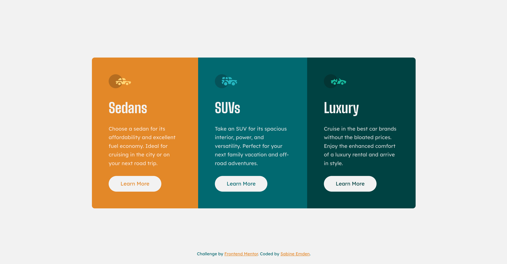

# Frontend Mentor - 3-column preview card component solution

This is a solution to the [3-column preview card component challenge on Frontend Mentor](https://www.frontendmentor.io/challenges/3column-preview-card-component-pH92eAR2-). Frontend Mentor challenges help me improve my coding skills by building realistic projects.

## Table of contents

- [Overview](#overview)
  - [The challenge](#the-challenge)
  - [Screenshot](#screenshot)
  - [Links](#links)
- [My process](#my-process)
  - [Built with](#built-with)
  - [What I learned](#what-i-learned)
  - [Continued development](#continued-development)
  - [Useful resources](#useful-resources)
- [Author](#author)
- [Acknowledgments](#acknowledgments)

## Overview

### The challenge

The brief for this project was to build out the 3-column preview card component and get it looking as close to the design as possible, starting with the following assets:

- Figma design file for mobile, tablet & desktop layouts
- JPEG design files for mobile & desktop layouts
- Style guide for fonts, colors, etc.
- Optimized image assets
- HTML file with pre-written content

Users should be able to:

- View the optimal layout depending on their device's screen size
- See hover states for interactive elements

### Screenshot



### Links

- [Frontend Mentor solution](https://www.frontendmentor.io/solutions/3-column-preview-card-component-GLVFVvCevi)
- [GitHub repository](https://github.com/SabineEmden/fm-3-column-preview-card-component)
- [Live site](https://sabineemden.github.io/fm-3-column-preview-card-component/)

## My process

### Built with

- Semantic HTML5 markup
- CSS custom properties
- Flexbox
- Mobile-first workflow

### What I learned

I needed a refresher on best practices for custom web fonts. I had taken a deep dive into this topic for my Frontend Mentor [QR code component solution](https://github.com/SabineEmden/qr-code-component).

The font families in this project are [Lexend Deca](https://fonts.google.com/specimen/Lexend+Deca) for normal text and [Big Shoulders](https://fonts.google.com/specimen/Big+Shoulders) for headings. Both are available as variable fonts. Lexend Deca has a weight axis. Big Shoulders has a weight axis and an optical size axis. Optical size adapts the style to specific text sizes. This project uses Lexend Deca only in regular (400) font weight and 15 px font size, Big Shoulders only in bold (700) font weight and 40 px font size. The files I downloaded from Google Fonts contain variable and static versions of the font families.

For Lexend Deca, the TTF file for the variable font has a size of 175 Kb. The size of TTF file for Lexend Deca Regular as a static font is only 78 Kb. I decided to use the static file. Inspection with [Wakamai Fondue](https://wakamaifondue.com/) showed 845 glyphs, much more than the 95 glyphs that are usually enough for English-only websites. Subsetting the font to Basic Latin with the [Font Subsetter](https://everythingfonts.com/subsetter) by Everything Fonts and converting the file to WOFF2 with the [ttf to woff2 converter](https://everythingfonts.com/ttf-to-woff2) also by Everything Fonts reduced the file size to 9 Kb.

For Big Shoulders, the TTF file for the variable font has a size of 319 Kb. The size of the TTF file for Big Shoulders 24 pt Bold as a static font is only 95 Kb. A font size of 24 pt is equivalent to 32 px. The next larger font size available in the download as a static font is 36 pt or 48 px. I decided to use the static 24 pt font. Inspection with Wakamai Fondue showed 1065 glyphs. Subsetting the font to Basic Latin and converting the file to WOFF2 reduced the file size to 10 Kb.

### Continued development

When I submitted this solution on the Frontend Mentor platform I was guessing the three buttons with the text "learn more" on the card component could negatively affects web accessibility. I hadn't looked into the issue more because I assumed to fix it I needed to enhance the HTML with WAI-ARIA, a topic I'm not yet familiar with.

The AI-enhanced accessibility report that Frontend Mentor provides for PRO subscribers confirmed the issue and recommended an easier fix: adding visually hidden text to the links to make them more descriptive for users of screens readers.

Before:

```html
<a href="#">Learn More</a>
```

After:

```html
<a href="#">Learn More <span class="sr-only">about Sedans</span></a>
```

```css
.sr-only {
  position: absolute;
  width: 1px;
  height: 1px;
  padding: 0;
  margin: -1px;
  overflow: hidden;
  clip: rect(0, 0, 0, 0);
  border: 0;
}
```

### Useful resources

- [Figma for developers](https://www.frontendmentor.io/articles/figma-for-developers-how-to-work-with-a-design-file-m6CZKZ1rC1) by Matt Studdert for Frontend Mentor - This article helped me to work with the Figma design file for this project and get information like spacing and sizes from it.

## Author

I'm an aspiring web developer and a former chemist. What I bring from chemistry to software development is a systematic approach to problem solving and the perseverance to not give up easily.

- Frontend Mentor - [SabineEmden](https://www.frontendmentor.io/profile/SabineEmden)
- Personal Website - [Sabine Emden](https://www.sabineemden.com/)
- Mastodon - [@sabineemden](https://social.tchncs.de/@sabineemden)

## Acknowledgments

This project uses Josh Comeau's [CSS Reset](https://www.joshwcomeau.com/css/custom-css-reset/).

The font families in this project are [Lexend Deca](https://fonts.google.com/specimen/Lexend+Deca) and [Big Shoulders](https://fonts.google.com/specimen/Big+Shoulders). The fonts are licensed under the [Open Font License](https://openfontlicense.org/open-font-license-official-text/).
